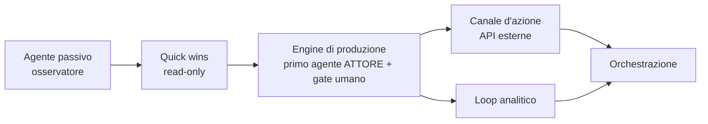

# KNOW-HOW — Sistema ad Agenti + Deployment

> Documento di trasferimento del know-how accumulato sul progetto **Shan Growth Agent**
> (scuola-cipriani) verso un nuovo progetto. Raccoglie architettura del sistema ad agenti,
> pattern di design, tecniche di deployment (Cloudflare Worker + Docker su edge) e lezioni apprese.
>
> Usare questo file come **blueprint riusabile**: i pattern qui descritti sono indipendenti
> dal dominio "scuola di kung fu" e applicabili a qualsiasi sistema agentico professionale.

---

## 1. Visione architetturale

### 1.1 Principio guida: da agenti "osservatori" ad agenti "attori"

Il salto di qualità di un sistema agentico professionale è passare da:

- **Agente osservatore** → raccoglie dati, produce report/finding, non agisce
- **Agente attore** → compie azioni nel mondo (pubblica, modifica, deploya) **con un gate umano**

> **Regola d'oro (enterprise / infrastruttura critica):** un'azione critica non deve **mai**
> essere autonoma senza autorizzazione. Il pattern *human-in-the-loop / Approval Gateway* è
> obbligatorio per ogni azione irreversibile o ad alto impatto.

### 1.2 Le 4 direzioni di un sistema agentico maturo

| Direzione | Ruolo | Quando introdurla |
|-----------|-------|-------------------|
| **A — Engine di produzione** | Genera l'output di valore (contenuti, config, codice) | Subito (è il motore) |
| **B — Canale d'azione** | Pubblica/applica l'output nel mondo reale (API esterne) | Dopo A, con gate umano |
| **C — Loop analitico** | Misura se A e B funzionano, chiude il ciclo coi dati | In parallelo a B |
| **D — Orchestrazione** | Supervisor + Registry + WorkQueue + ApprovalGateway | Solo con ≥3 agenti attivi |

> **Anti over-engineering:** introdurre l'orchestrazione (D) solo quando ci sono almeno 3 agenti
> attivi. Prima è complessità ingiustificata.

### 1.3 Sequenza di adozione raccomandata



Partire **sempre** da quick win read-only (basso rischio) per costruire i mattoni condivisi
(DB, scheduler, notifier) prima di abilitare azioni che modificano il mondo.

---

## 2. Architettura del codice (pattern riusabili)

Stack di riferimento: **Python 3.12, FastAPI, APScheduler, SQLite (WAL), httpx, BeautifulSoup, Docker**.
Tutti i pattern sotto sono indipendenti dal linguaggio.

### 2.1 Template Method — `Agent.run()`

Lo scheletro di ogni agente è fisso; le sottoclassi riempiono solo i passi variabili.

```
run() = collect() → analyze() → persist() → return report
```

- `collect()` → **solo I/O**, nessuna analisi (raccolta dati grezzi dal mondo)
- `analyze()` → trasforma i dati grezzi in `(status, summary, findings)`
- `persist()` + timing + safety-net delle eccezioni → **gestiti dalla base class**

Vantaggi: ogni nuovo agente eredita gratis persistenza, logging strutturato, gestione errori,
misurazione token e timing. Zero boilerplate ripetuto.

```python
class Agent(ABC):
    name: str = "base"

    @abstractmethod
    def collect(self) -> dict: ...

    @abstractmethod
    def analyze(self, raw: dict) -> tuple[Status, str, list[Finding]]: ...

    def run(self) -> AgentReport:
        # timing + collect + analyze + try/except safety-net + persist
        ...
```

### 2.2 ReAct loop — `LLMAgent`

Sottoclasse di `Agent` che implementa `analyze()` come **loop agentico**
(Reason → Act → Observe → Repeat) con un cap di sicurezza.

- `MAX_ITERATIONS = 15` → evita loop infiniti / token burn
- Le sottoclassi implementano solo `build_system_prompt(context)` e `get_tools()`
- Un tool speciale `report_findings` **termina il loop** e cattura il risultato strutturato
- Ogni iterazione accumula `input_tokens` / `output_tokens` per tracciare il costo

> **Lezione:** il loop deve essere **provider-agnostic**. La risposta di ogni provider viene
> normalizzata in un dict comune (`stop_reason`, `tool_uses`, `assistant_message`, token) così
> il loop non sa se sta parlando con Anthropic, OpenAI o GitHub Models.

### 2.3 Tool layer — dispatch estensibile

Ogni capability è **un tool = schema JSON + funzione Python**, registrata in un dizionario:

```python
TOOL_DISPATCH: dict[str, Callable] = {
    "fetch_url": tool_fetch_url,
    "extract_seo_meta": tool_extract_seo_meta,
    "check_tls": tool_check_tls,
    "check_sitemap": tool_check_sitemap,
    # report_findings è gestito specialmente nel loop
}
```

Aggiungere una capability = aggiungere uno schema + una funzione. **Open/Closed**: nessuna
modifica alla logica core dell'agente.

> Schema tool in formato Anthropic (`name`, `description`, `input_schema`). L'adapter OpenAI
> converte automaticamente in formato function-calling. Scrivi una volta, gira ovunque.

### 2.4 Strategy + Factory — provider LLM

Interfaccia minima `LLMClient` (Protocol) con strategie concrete intercambiabili:

| Client | Note |
|--------|------|
| `AnthropicClient` | SDK Anthropic, formato tool nativo |
| `OpenAIClient` | SDK OpenAI, converte schema tool Anthropic→OpenAI |
| `GitHubModelsClient` | **eredita da OpenAIClient**, cambia solo `base_url` + auth con GitHub PAT |
| `NullLLMClient` | no-op per dev/CI quando nessun provider è configurato |

```python
def build_llm_client(provider, ...) -> LLMClient:
    if provider == "anthropic" and anthropic_key: return AnthropicClient(...)
    if provider == "openai" and openai_key:       return OpenAIClient(...)
    if provider == "github_models" and gh_token:  return GitHubModelsClient(...)
    return NullLLMClient()  # degrada con grazia, non crasha
```

- **Lazy import** degli SDK → startup leggero, importi solo il provider che usi
- `NullLLMClient` → degradazione controllata invece di crash quando manca la config

### 2.5 GitHub Models come provider LLM gratuito

Trucco di costo importante per pilot/prototipi:

- Endpoint: `https://models.inference.ai.azure.com`
- Auth: **GitHub Personal Access Token** (zero scope necessari, accesso via subscription Copilot)
- API: **identica a OpenAI** → riusa `OpenAIClient` cambiando solo `base_url`
- Modelli: `gpt-4.1`, `gpt-4o`, `gpt-4o-mini`, Llama, Mistral…
- Free tier: ~15 RPM, ~150K token/giorno → sufficiente per prototipi e volumi bassi
- Quando il volume cresce → switch a OpenAI/Anthropic diretto **senza toccare il codice agente**
  (solo config)

### 2.6 Scheduler — Factory + Dependency Injection

`APScheduler` `BackgroundScheduler` con job cron. Le dipendenze (`db`, `notifier`, `llm`) sono
**iniettate via costruttore**, non create dentro l'agente → testabilità e disaccoppiamento.

```python
def build_scheduler(settings, db, notifier, llm) -> BackgroundScheduler:
    agent = SomeAgent(db=db, llm=llm, ...)        # DI
    sched.add_job(_run_agent_and_notify,
                  trigger=CronTrigger(hour=7, minute=0),
                  kwargs={"agent": agent, "notifier": notifier},
                  max_instances=1, coalesce=True, replace_existing=True)
    return sched
```

- `max_instances=1` + `coalesce=True` → niente run sovrapposte/accumulate
- `_run_agent_and_notify` → notifica solo se status ≠ ok (o `notify_on_ok=True`)

### 2.7 Persistenza — SQLite con run + findings

Due tabelle: `agent_runs` (uno per esecuzione) e `findings` (N per run, FK su run_id).
Ogni run è tracciato con timing, status, summary e dettagli JSON. SQLite in modalità **WAL**
per letture concorrenti dalla dashboard mentre lo scheduler scrive.

### 2.8 Notifier — canale già pronto

Adapter notifier (es. Telegram) operativo. Per il human-in-the-loop si estende con
**InlineKeyboardMarkup** (bottoni ✅ Approva / ✏️ Modifica / ❌ Scarta) e **polling**
`getUpdates` (non webhook) quando il nodo è in LAN senza IP pubblico.

---

## 3. Pattern obbligatori (checklist di review)

Ogni feature deve rispettare:

### SOLID
- **S** — ogni agente/modulo ha una sola responsabilità
- **O** — nuovi tool/provider/canali si aggiungono senza modificare la logica core
- **L** — tutti i provider implementano la stessa interfaccia, intercambiabili
- **I** — i client dipendono solo dai metodi che usano
- **D** — i moduli di alto livello dipendono da astrazioni (Protocol/interfacce), non da implementazioni

### Design Patterns
- **Template Method** — flussi multi-step standardizzati (`Agent.run()`, pipeline di deploy)
- **Strategy + Factory** — selezione provider/canale a runtime
- **Adapter** — normalizzare risposte di API esterne instabili in modelli di dominio interni
- **Dependency Injection** — sempre via costruttore (testing + disaccoppiamento)
- **Command / Approval Gateway** — azioni critiche reificate + gate umano + rollback

---

## 4. Deployment

### 4.1 Sito statico → Cloudflare Worker con Static Assets

> **ATTENZIONE — errore classico:** un sito può essere servito come **Cloudflare Worker**
> *oppure* come **Cloudflare Pages**. Sono due cose diverse. Confonderle fa perdere ore.

**Worker con Static Assets** (caso scuola-cipriani):

```bash
# 1. PATH per Node/nvm
export PATH="/home/<user>/.nvm/versions/node/v22.22.2/bin:$PATH"

# 2. Build (React + Vite → dist/)
pnpm build

# 3. Deploy (Worker + Assets)
npx wrangler deploy

# 4. Push sorgente su GitHub = SOLO backup/versioning, NON fa il deploy
git add -A && git commit -m "..." && git push origin main
```

`wrangler.toml` (Worker, **non** Pages):

```toml
name = "<worker-name>"
compatibility_date = "2025-01-01"

routes = [
  { pattern = "dominio.it/*",     zone_name = "dominio.it" },
  { pattern = "www.dominio.it/*", zone_name = "dominio.it" }
]

[assets]
directory = "./dist"
not_found_handling = "single-page-application"
```

**Verifica post-deploy:**
```bash
curl -s https://www.dominio.it/ | grep -E "(canonical|description)" | head -3
```

**Errori da NON ripetere:**

| Errore | Causa | Soluzione |
|--------|-------|-----------|
| `wrangler pages deploy` / creare progetto Pages | Confusione Worker vs Pages | Usare solo `wrangler deploy` |
| Push su GitHub senza `wrangler deploy` | Non c'è CI/CD automatico | Lanciare sempre `wrangler deploy` dopo il build |
| `../dist` come path | `dist/` è dentro la cartella del progetto | Path relativo corretto `dist` |
| Token Cloudflare scaduto | OAuth token scade ~24h | `npx wrangler login` |
| Aggiungere `pages_build_output_dir` | È una direttiva Pages | Non usarla nei Worker |

> Il `dist/index.html` è **generato** da `pnpm build`. Modificare il **sorgente**
> (es. `client/index.html`), mai il file in `dist/`.

### 4.2 Servizio agentico → Docker su nodo edge (Raspberry Pi / ARM64)

Pattern: codice in locale → package → `scp` su nodo → rebuild Docker → restart.

```bash
# Esempio: deploy su nodo edge (Pi ARM64)
ssh <user>@<host> 'cd /opt/<project> && \
  echo "<sudo-pw>" | sudo -S docker compose build 2>&1 | tail -20'
ssh <user>@<host> 'cd /opt/<project> && \
  echo "<sudo-pw>" | sudo -S docker compose up -d --force-recreate'
```

**Lezioni edge/ARM64:**
- Usare `--no-cache` nel build quando cambiano `config`/`pyproject.toml`/dipendenze
- Usare `--force-recreate` su `up` per applicare nuove env/immagini
- **Niente modelli ML locali su Pi 4** (no GPU): generazione immagini = 20–45 min/img, insostenibile.
  Usare API esterne (es. Together AI free tier) e uno storage intermedio per URL pubblici
  (il Pi è in LAN, le API esterne hanno bisogno di un URL HTTPS pubblico → imgbb / Cloudflare R2)
- Nodo in LAN → per i bot usare **polling**, non webhook
- `restart: unless-stopped` su tutti i container per auto-restart al reboot

### 4.3 Regola di processo: documentare il deploy

Mantenere sempre un `DEPLOYMENT.md` nel repo con:
- Architettura del deploy (diagramma sorgente→build→deploy→dominio)
- Procedura passo-passo copia-incollabile
- Comando di verifica post-deploy
- Tabella "errori da NON ripetere"
- Credenziali/ID account (Account ID, Zone ID, nome servizio)

> E una memoria persistente (repo-scoped) che impone "leggi DEPLOYMENT.md prima di ogni deploy".

---

## 5. Sicurezza / NIS2 (contesto infrastruttura critica)

Per progetti enterprise/SATCOM applicare sempre:

- **Injection prevention** — sanitizzazione input ai boundary di sistema
- **Shell safety** — mai costruire comandi shell per concatenazione di stringhe non validate
- **Secret handling** — token/password mai nel codice né nei log; solo `.env` / secret store
- **Rate limiting / lockout** — sui login endpoint (es. 5 tentativi → 15 min lockout) + Fail2Ban
- **HTTPS obbligatorio** — reverse proxy nginx davanti ai servizi
- **Audit logging** — tracciare ogni azione critica e ogni approvazione human-in-the-loop
- **Token rotation** — i long-lived token (es. Meta 60gg) richiedono un job automatico di refresh

> Bonifica i token prima di committare. Non loggare mai preview di prompt che possano contenere segreti.

---

## 6. Costo / Model Routing

Pattern di cost-optimization riusabile (delega per modello):

| Tipo di task | Modello consigliato |
|--------------|---------------------|
| Operazioni ripetitive a basso valore cognitivo (git, scp, build, commit message) | Modello economico (GPT-4.1 / Haiku) |
| Design, decisioni architetturali, conflict resolution complessi | Modello forte (Sonnet / Opus) |
| Prototipi e volumi bassi | GitHub Models free tier (gpt-4.1, gratis) |

- Tracciare `input_tokens`/`output_tokens` per ogni run dell'agente (già nel loop ReAct)
- Quando si delega a un sub-task, passare **solo il contesto strettamente necessario**, non l'intero piano

---

## 7. Lezioni apprese (sintesi)

1. **Separare deterministico da LLM** — non far decidere all'LLM cose che una funzione pura risolve meglio (parsing, validazione). L'LLM ragiona e orchestra; i tool eseguono.
2. **Normalizzare i provider** — un layer di adapter rende il loop indipendente dal vendor LLM.
3. **Degradare con grazia** — `NullLLMClient` invece di crash quando manca la config.
4. **Gate umano per le azioni** — mai pubblicare/applicare senza approvazione esplicita.
5. **Quick win read-only prima** — costruisci DB/scheduler/notifier in sicurezza, poi abilita le azioni.
6. **Cap di iterazioni** — ogni loop agentico ha un `MAX_ITERATIONS` per non bruciare token.
7. **Worker ≠ Pages** — sapere esattamente come è deployato il sito prima di toccarlo.
8. **Edge ≠ cloud** — su ARM4/Pi niente ML locale, niente webhook; usa API esterne + polling.
9. **Documenta il deploy** — un `DEPLOYMENT.md` + memoria persistente evita di ripetere gli stessi errori.
10. **DI ovunque** — inietta `db`/`llm`/`notifier` via costruttore per poter testare tutto.

---

## 8. Struttura di progetto di riferimento

```
<project>/
  src/<pkg>/
    agents/
      base.py          # Agent (Template Method) + LLMAgent (ReAct loop)
      <feature>.py     # agenti concreti: collect() + build_system_prompt() + get_tools()
    adapters/
      llm.py           # Strategy + Factory provider LLM (Anthropic/OpenAI/GitHub Models/Null)
      notifier.py      # canale notifiche (Telegram) + human-in-the-loop
      <external>.py    # adapter per API esterne (normalizzazione → modelli di dominio)
    tools/
      web_tools.py     # TOOL_DISPATCH: schema JSON + impl Python per ogni capability
    core/
      db.py            # SQLite (WAL), connessioni
      scheduler.py     # APScheduler, Factory + DI dei job
      config.py        # Settings da env (provider, chiavi, hook capability)
      logging.py       # logging strutturato
  migrations/          # SQL numerate (001_..., 002_...)
  docker-compose.yml   # servizi (db, collector/agent, frontend) — restart: unless-stopped
  DEPLOYMENT.md        # procedura deploy + errori da non ripetere
  pyproject.toml
```

---

*Documento generato come trasferimento di know-how dal progetto Shan Growth Agent (scuola-cipriani).
Adattare nomi di dominio, credenziali e capability al nuovo progetto.*
