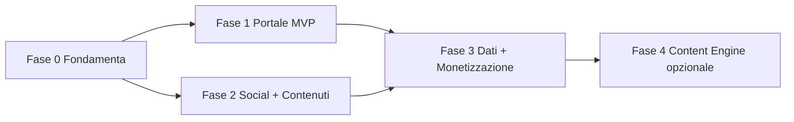

# 12 — Roadmap di Sviluppo

> Roadmap completa per fasi. **Da approvare prima di iniziare l'implementazione.**
> Principio guida (KNOW_HOW): quick-win read-only prima, azioni con gate umano, niente
> over-engineering. La Fase 2 (automazione) si avvia solo quando il volume lo giustifica.

---

## Fase 0 — Fondamenta e validazioni (sblocco)

Prerequisiti che dipendono da te (in parallelo allo sviluppo).

- [x] **Dominio**: `tutordigitale.com` creato su **Cloudflare** (`PUBLIC_SITE_URL=https://tutordigitale.com`).
- [x] **Persona creator**: **Giuseppe** (vedi `01`). _Restano da definire foto profilo e storia personale._
- [ ] **Handle social** verificati su tutte le piattaforme (`@tutordigitale` / `@iltutordigitale`).
- [ ] **Account**: GitHub Pro + Copilot, Cloudflare (✅), Brevo, Amazon Affiliati (richiesta).
- [ ] **Credenziali Cloudflare**: recuperare API token/Account ID (riuso da progetto scuolacipriani) per CI/CD.
- [ ] **Commercialista**: valutazione fiscale (occasionale vs P.IVA/forfettario) — vedi `11`.
- [ ] **Repo GitHub** `il-tutor-digitale` (private) + struttura `web/` + `docs/`.

**Deliverable**: ambiente pronto, variabili di progetto definite.

---

## Fase 1 — Portale MVP (il cuore)

Obiettivo: portale statico live, accessibile, SEO/AEO-ready, con deploy automatico.

### 1.1 Setup tecnico
- [ ] Init Astro in `web/` + Tailwind + TypeScript strict + integrazioni (sitemap, react).
- [ ] Token brand in `tailwind.config.mjs` da `docs/06` + `global.css` (font, focus, scala).
- [ ] `.github/copilot-instructions.md` + `.gitignore` + `.env.local`.
- [ ] CI/CD `deploy.yml` → Cloudflare Pages (build da `web/`), preview per PR.
- [ ] Collegamento dominio + HTTPS + Email Routing (`info@<dominio>`) + Web Analytics.

### 1.2 Struttura e componenti base
- [ ] `BaseLayout` + `Header` (sticky, mobile menu) + `Footer`.
- [ ] Componenti UI: `Button`, `Card`, `Badge`, `VideoCard`, `VideoEmbed`.
- [ ] Componenti SEO: `SEOHead`, `ArticleSchema`, `FaqBlock`, `HowToSchema`, `VideoSchema`, `PersonSchema`.

### 1.3 Pagine
- [ ] Home (8 sezioni, vedi `05`), Chi sono, Tutorial (lista+`[slug]`), Blog (lista+`[...slug]`),
      Prodotti, Contatti (form), Privacy/Cookie.
- [ ] Schema contenuti `config.ts` (con campo `faq[]`).
- [ ] Lead magnet + form newsletter Brevo (double opt-in).

### 1.4 Contenuti iniziali
- [ ] 3-5 articoli blog AEO-ready (con `content-strategist` + `script-writer` + `seo-aeo-specialist`).
- [ ] `videos.json`, `products.json`, `social-links.json` popolati.

### 1.5 Qualità e legale
- [ ] Lighthouse Perf >90, SEO 100, A11y >95 (`web-tester`).
- [ ] Privacy/Cookie policy pubblicate; disclosure affiliate; consensi GDPR (`11`).
- [ ] Sitemap inviata a Google Search Console.

**Deliverable**: portale live, indicizzabile, conforme, con primi contenuti.
**Workflow per ogni task**: piano (tech-lead) → impl (`astro-developer`) → review (`web-reviewer`)
→ test (`web-tester`) → git (`git-ops`) → deploy automatico.

---

## Fase 2 — Canali social e produzione contenuti (manuale)

Obiettivo: presenza social attiva + ritmo editoriale sostenibile, **senza** automazione.

- [ ] Brand asset (Canva): logo, thumbnail, copertine, template (vedi `06`).
- [ ] Apertura e ottimizzazione canali: YouTube, Facebook (+gruppo), Instagram, TikTok, Linktree.
- [ ] Calendario editoriale del mese (`content-strategist`).
- [ ] Produzione settimanale: 1 video + clip derivate + post + articolo (riuso 1→7).
- [ ] Community management (`community-manager`).

**Deliverable**: canali attivi, ≥4 video, ritmo editoriale avviato, prime metriche.

---

## Fase 3 — Loop dati e monetizzazione

Obiettivo: misurare, ottimizzare, iniziare a guadagnare.

- [ ] Integrazione dati: Search Console + YouTube Analytics + Cloudflare Analytics.
- [ ] Loop editoriale data-driven (temi su query in posizione 5-15, video top).
- [ ] Affiliate Amazon attivi sul portale + lead magnet → lista newsletter.
- [ ] Primo prodotto digitale (guida PDF) su Gumroad/Payhip.
- [ ] Media kit + prime email sponsor (`monetization-advisor`).
- [ ] Adempimenti fiscali attivati se i ricavi lo richiedono (`11`).

**Deliverable**: primi ricavi, decisioni editoriali guidate dai dati.

---

## Fase 4 — Content Engine (automazione, opzionale)

Da avviare **solo** se il volume manuale diventa insostenibile (≳8 contenuti/mese su più canali).

- [ ] `engine/` Python: `ScriptAgent`, `SeoAeoAgent`, `CalendarAgent` (Template Method + ReAct).
- [ ] Provider LLM via GitHub Models (free) con fallback OpenAI/Anthropic.
- [ ] Loop dati automatico (adapter YouTube/Search Console).
- [ ] **Gate umano** Telegram (Approva/Modifica/Scarta) + audit log.
- [ ] Deploy Docker (`restart: unless-stopped`).

**Deliverable**: bozze generate automaticamente, pubblicazione sempre con approvazione umana.

---

## Sequenza e dipendenze

> Fase 1 e Fase 2 possono procedere in parallelo (sviluppo portale ⟂ apertura canali).
> Fase 4 è opzionale e subordinata al volume reale.

---

## Cosa serve da te per partire (gate di approvazione)

1. ✅ Roadmap e documentazione `docs/` approvate.
2. ✅ **Dominio** `tutordigitale.com` (Cloudflare) e **persona creator** Giuseppe confermati.
3. ✅ Scope iniziale: **Fase 1 + Fase 2 in parallelo**.
4. ✅ **Content engine (Fase 4)** previsto fin da subito nell'architettura.

### Decisioni operative confermate
- Sviluppo portale (Fase 1) e apertura/ottimizzazione canali social (Fase 2) procedono **in parallelo**.
- L'architettura riserva fin da ora lo spazio per `engine/` (Content Engine), pur costruendolo solo
  quando il volume lo richiede (no over-engineering): la struttura del repo e i contratti dati sono
  predisposti subito.

> Prossimo passo operativo: creare il `tech-lead` di progetto e avviare la **Fase 0/1**
> (setup repo + Astro) in parallelo alla **Fase 2** (brand asset + apertura canali).
